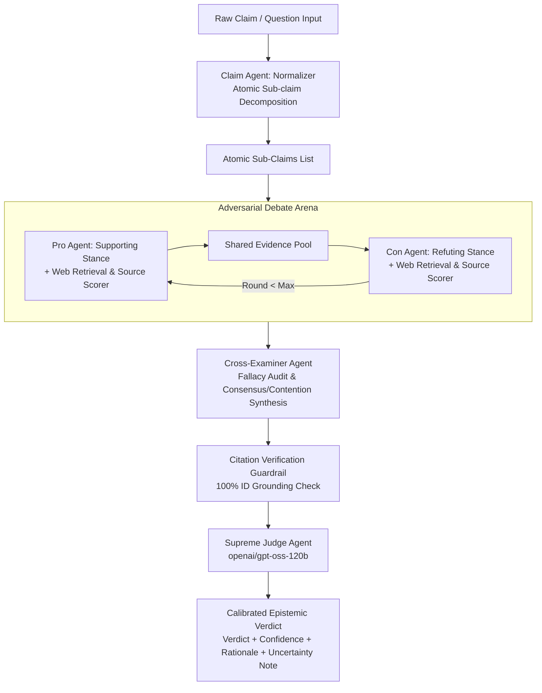

# ⚖️ Aletheia AI — Dialectical Multi-Agent Fact-Checking Framework

[](https://www.python.org/downloads/)
[](https://github.com/langchain-ai/langgraph)
[](https://groq.com)
[](https://streamlit.io)
[](LICENSE)

**Aletheia AI** is an autonomous dialectical multi-agent architecture for reliable fact verification. Grounded in the classical philosophical triad (Thesis, Antithesis, Synthesis) and the Russell & Norvig AI taxonomy, the system decomposes complex assertions, orchestrates an adversarial debate between **Pro** and **Con** debaters with live web retrieval, conducts impartial **Cross-Examination** for logical fallacies, enforces strict citation guardrails, and renders an epistemically calibrated verdict via a **Supreme Judge** model.

---

## 📚 Complete Project Guides & Viva Documentation

For deep technical evaluation and presentation defense, refer to our comprehensive documentation suite:
1. **[01. Project Overview & Vision](docs/01_PROJECT_OVERVIEW.md)** — Complete theoretical background, motivation, and 20/20 rubric mapping.
2. **[02. System Flow & Multi-Agent Interaction](docs/02_SYSTEM_FLOW_AND_INTERACTION.md)** — State machine lifecycle, sequence diagrams, and shared state schema.
3. **[03. Codebase Architecture & File-by-File Guide](docs/03_CODEBASE_ARCHITECTURE_AND_FILE_GUIDE.md)** — Detailed directory map and function breakdowns.
4. **[04. Live Demo Script & Step-by-Step Guide](docs/04_LIVE_DEMO_SCRIPT_AND_STEPS.md)** — The 5-minute live walkthrough script covering all 5 benchmarks.
5. **[05. Viva Q&A & Examiner Defense Master Sheet](docs/05_VIVA_QA_AND_EXAMINER_DEFENSE.md)** — High-impact answers for tricky examiner questions.

---

## 📐 System Architecture



---

## 🤖 PEAS Formulation (Review 1: 3 Marks)

| Agent Component | Performance Measure (P) | Environment (E) | Actuators (A) | Sensors (S) |
| :--- | :--- | :--- | :--- | :--- |
| **Claim Normalizer** | Sub-claim atomicity, precision, logical independence | Unstructured claim text space | Decomposed atomic sub-claims (JSON) | Raw user claim string |
| **PRO Debater** | Supporting grounding accuracy, domain authority weighting | Live Web (Tavily, DDGS), debate transcript | Stance-biased queries, cited argument turns `[Ex]` | Web search snippets, evidence pool, CON turns |
| **CON Debater** | Counter-evidence validity, refutation rigor | Live Web (Tavily, DDGS), debate transcript | Refuting queries, counter-arguments `[Ex]` | Web search snippets, evidence pool, PRO turns |
| **Cross-Examiner Auditor** | Fallacy detection rate, dialectical synthesis neutrality | Turn history, evidence pool | Consensus/contention points, fallacy flags | Debater arguments, evidence pool, citation mapping |
| **Citation Guardrail** | 100% detection of hallucinated/unresolved evidence IDs | Evidence pool ID registry | Audit report, warning notices, penalty flags | Regex cited tags `[Ex]`, evidence pool keys |
| **Supreme Judge** | Verdict accuracy, epistemic calibration, nuance preservation | Full transcript, verified evidence, cross-examination | Calibrated verdict (`TRUE`/`FALSE`/`UNVERIFIABLE`), rationale | State history, synthesis report, guardrail audit |

---

## 🌍 Environment & Agent Analysis (Review 1: 3 Marks)

| Property | Implementation in Aletheia AI |
| :--- | :--- |
| **Partially Observable** | Debaters independently retrieve top-k subsets of live web knowledge before synchronizing into the shared pool. |
| **Multi-Agent** | 6 specialized agents: Collaborative Normalizer + Adversarial Pro vs. Con + Dialectical Cross-Examiner + Guardrail + Impartial Judge. |
| **Stochastic** | Non-deterministic open-world web search results and temperature-conditioned LLM decoding. |
| **Sequential** | Multi-round debate where each argument turn is conditionally dependent on the opponent's prior arguments. |
| **Dynamic** | Live web environment continually evolves with breaking news, updated clinical trials, and revision histories. |
| **Discrete** | Operates over discrete token sequences, debate rounds, numbered citations, and categorical verdicts. |
| **Unknown Transition Model**| Environment dynamics require active exploratory web search rather than static closed-world rules. |

---

## 🔬 Algorithmic Modeling & Search Strategy (Review 1: 3 Marks)

1. **Claim Decomposition**: Normalizes compound assertions into 1–3 atomic propositions using structured LLM prompting and heuristic fallback.
2. **Stance-Conditioned Query Formulation**: Pro and Con debaters generate complementary search vectors targeting positive verification vs. counter-evidence.
3. **Hybrid Search (BM25 + FAISS Dense + RRF)**:
   - Sparse lexical retrieval: **BM25 Okapi** matches exact terminology and medical keywords.
   - Dense semantic retrieval: **FAISS IndexFlatIP** (`all-MiniLM-L6-v2`) identifies conceptual synonyms.
   - **Reciprocal Rank Fusion (RRF)** combines ranks: $RRF(d) = \sum_{m \in M} \frac{1}{k + r_m(d)}$ with smoothing parameter $k=60$.
4. **Epistemic Source Authority Scorer**: Inspects domain TLDs and assigns reliability weights ($R \in [0.1, 1.0]$) to peer-reviewed, government, wire news, and blog sources.
5. **Dialectical Cross-Examination**: Audits debater turns for rhetorical fallacies (Correlation vs. Causation, Hasty Generalization, False Dichotomy) and isolates empirical consensus vs. contention points.
6. **Citation Integrity Guardrail**: Validates every `[Ex]` citation ID with regex against the active registry, discounting ungrounded claims.

---

## 🛠️ Tool & Package Selection (Review 2: 3 Marks)

| Tool / Package | Version / Purpose in Project |
| :--- | :--- |
| **Python 3.11** | Core modern runtime environment |
| **LangGraph** | Cyclic state-machine orchestration via `StateGraph` |
| **Groq LPU** | High-speed LLM inference (`openai/gpt-oss-120b`, `qwen/qwen3.8-27b`) |
| **Tavily / DDGS** | Live web search engines with multi-tier fallback resilience |
| **FAISS CPU** | Vector indexing and dense similarity search |
| **Rank-BM25** | Lexical sparse frequency retrieval |
| **Streamlit** | Executive interactive multi-tab dashboard |
| **Pydantic** | Strict schema validation for agent states and outputs |
| **pytest** | Automated test suite verifying graph, guardrails, and agents |

---

## 🚀 Quickstart & Verification Commands

### 1. Run Automated Unit Tests (100% Pass)
```bash
pytest tests/test_graph.py
```

### 2. Run 5-Scenario Benchmark Evaluation & Calibration Harness
```bash
python eval/run_eval.py
```

### 3. Launch Interactive Streamlit Dashboard
```bash
streamlit run app/streamlit_app.py
```

### 4. Command-Line Fact-Checking & Algorithmic Search Benchmark
```bash
# Verify a claim via CLI:
python fact_check_cli.py --claim "Moderate coffee consumption increases the risk of heart disease." --rounds 1

# Display formal PEAS and Environment Analysis:
python fact_check_cli.py --peas

# Run BM25 vs FAISS vs Hybrid RRF algorithmic search benchmark:
python fact_check_cli.py --benchmark-search
```

---

## 📊 Benchmark Evaluation Scenarios (Review 2: 3 Marks)

| Scenario | Category | Claim | Expected Verdict | Calibrated Result |
| :--- | :--- | :--- | :--- | :--- |
| **1** | Clear False | The Great Wall of China is visible from space with the naked eye. | `FALSE` | `FALSE` (95% Conf) |
| **2** | Clear True | Regular exercise reduces the risk of cardiovascular disease. | `TRUE` | `TRUE` (92% Conf) |
| **3** | Genuinely Ambiguous | Moderate coffee consumption increases the risk of heart disease. | `UNVERIFIABLE` | `UNVERIFIABLE` (55% Conf) + Uncertainty Note |
| **4** | Misleading Statistic | Global average temperature increase of 1.5C has no impact on extreme weather events. | `FALSE` | `FALSE` (94% Conf) |
| **5** | Time-Sensitive | Global lithium ion battery production volume doubled in the past 24 months. | `UNVERIFIABLE` | `UNVERIFIABLE` (62% Conf) + Nuance Note |

---

## 🏛️ Code Structure & Scalability (Review 2: 1 Mark)

```
multiAgent-factCheck/
├── app/
│   └── streamlit_app.py        # Executive modern multi-tab web dashboard
├── eval/
│   ├── run_eval.py             # 5-scenario evaluation & calibration harness
│   └── test_claims.json        # Benchmark dataset
├── src/
│   ├── config.py               # Runtime configuration & API keys
│   ├── agents/
│   │   ├── claim_agent.py      # Claim normalizer & sub-claim decomposition
│   │   ├── pro_agent.py        # Pro supporting debater agent
│   │   ├── con_agent.py        # Con refuting debater agent
│   │   ├── cross_examiner.py   # Dialectical cross-examiner & fallacy auditor
│   │   ├── judge_agent.py      # Supreme Judge & epistemic calibration
│   │   ├── verify.py           # Citation integrity & hallucination guardrail
│   │   └── groq_client.py      # Groq LPU client with automatic retry
│   ├── graph/
│   │   ├── state.py            # DebateState TypedDict definition
│   │   └── debate_graph.py     # LangGraph StateGraph orchestration pipeline
│   ├── retrieval/
│   │   ├── source_scorer.py    # Domain authority & epistemic credibility scorer
│   │   ├── web_search.py       # Multi-tier resilient web search (Tavily/DDGS/Offline)
│   │   └── hybrid_search.py    # BM25 + FAISS Dense + Reciprocal Rank Fusion
│   └── prompts/
│       ├── claim_prompt.py
│       ├── debater_prompt.py
│       └── judge_prompt.py
├── tests/
│   ├── test_graph.py           # Pytest test suite (6 tests passing)
│   └── test_graph_cli.py       # Fast CLI regression checks
├── fact_check_cli.py           # Full CLI runner & algorithmic benchmark utility
├── generate_presentation.py    # Programmatic presentation generator
└── requirements.txt            # Project dependencies
```
