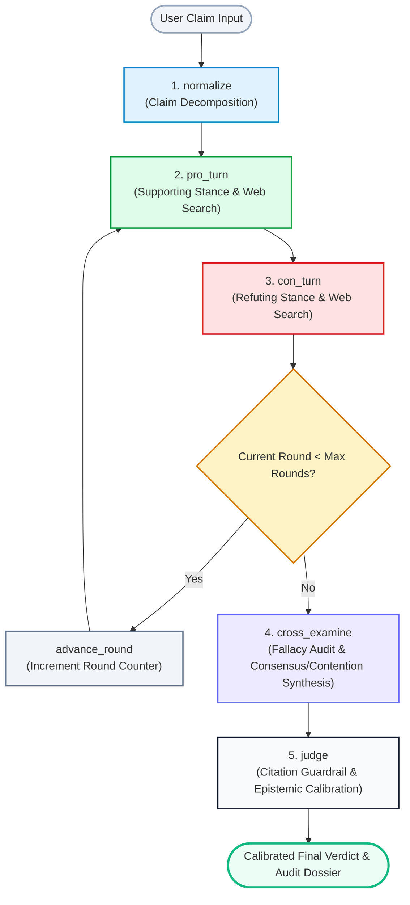
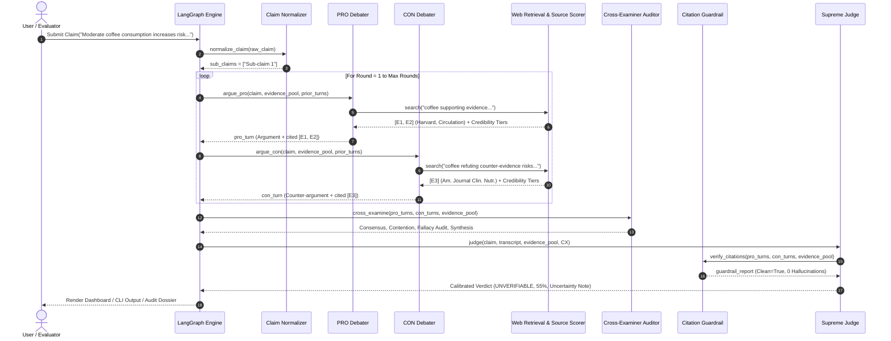

# 🔄 Document 2: System Flow & Multi-Agent Interaction — Aletheia AI

**Course:** Foundations of Artificial Intelligence (FAI)  
**Rubric Focus:** Review 2 — Multi-Agent Execution & Interaction (3 Marks)  
**Orchestration Engine:** LangGraph (`StateGraph`), TypedDict State Transitions  

---

## 1. High-Level Architectural Flow

Aletheia AI models fact verification as a **Dialectical Multi-Agent State Machine**. Instead of a static linear pipeline, it executes an iterative, cyclic debate graph with an impartial cross-examination checkpoint before judicial adjudication:



---

## 2. Step-by-Step Lifecycle & Inter-Agent Coordination

### Phase 1: Input Ingestion & Claim Normalization (`node_normalize`)
- **Agent:** Claim Normalizer (`src/agents/claim_agent.py`)
- **Action:** Takes the raw user claim (which may be compound, ambiguous, or rhetorically loaded) and normalizes it into 1–3 independent, atomic, checkable sub-claims.
- **Example:**
  - *Input:* "Moderate coffee consumption reduces mortality and improves cognitive focus, but destroys cardiovascular endurance."
  - *Normalized Sub-claims:*
    1. "Moderate coffee consumption reduces all-cause mortality."
    2. "Moderate coffee consumption improves cognitive focus."
    3. "Moderate coffee consumption impairs cardiovascular endurance."
- **State Update:**
  `state["sub_claims"] = ["Sub-claim 1", "Sub-claim 2", ...]`

---

### Phase 2: Adversarial Debate Turns (`node_pro_turn` ⟷ `node_con_turn`)

#### 2A. Pro Debater Turn (`node_pro_turn`)
- **Agent:** PRO Debater (`src/agents/pro_agent.py`)
- **Action:**
  1. Formulates stance-conditioned queries targeting affirmative evidence (e.g., `"{claim} supporting evidence studies research benefits true"`).
  2. Calls `src/retrieval/web_search.py` to retrieve the top-3 empirical web snippets.
  3. Registers each newly found source into `state["evidence_pool"]` with an assigned citation tag (`[E1]`, `[E2]`).
  4. Calls `src/retrieval/source_scorer.py` to tag each evidence snippet with its domain credibility tier and authority badge.
  5. Reviews the prior debate transcript (opponent's counter-arguments, if round > 1) and synthesizes a grounded argument strictly citing the evidence IDs.
- **State Update:**
  `state["pro_turns"].append({"round": r, "argument": "...", "cited_evidence_ids": ["E1", "E2"]})`

#### 2B. Con Debater Turn (`node_con_turn`)
- **Agent:** CON Debater (`src/agents/con_agent.py`)
- **Action:**
  1. Formulates adversarial search queries targeting refuting evidence, clinical confounders, and health risks (e.g., `"{claim} refuting counter-evidence risks health harm false debate study"`).
  2. Queries live web retrieval and registers new counter-evidence into `state["evidence_pool"]` (`[E3]`, `[E4]`).
  3. Inspects the PRO agent's latest turn and attacks its logical vulnerabilities, dosage assumptions, or sample biases.
- **State Update:**
  `state["con_turns"].append({"round": r, "argument": "...", "cited_evidence_ids": ["E3", "E4"]})`

#### 2C. Conditional Routing (`route_next_turn`)
- Checks `state["round"] < state["max_rounds"]`.
- If true, calls `node_advance_round` (`state["round"] += 1`) and loops back to `node_pro_turn`.
- If false, transitions directly to `node_cross_examine`.

---

### Phase 3: Dialectical Cross-Examination & Fallacy Audit (`node_cross_examine`)
- **Agent:** Cross-Examiner Agent (`src/agents/cross_examiner.py`)
- **Action:**
  - Operates as an impartial judicial officer; does not take either side.
  - Audits both PRO and CON argument texts for formal and informal reasoning fallacies:
    - **Correlation vs. Causation:** Did an agent treat an observational cohort study as definitive proof of causation?
    - **Hasty Generalization:** Did an agent use sweeping universals ("always", "everyone", "impossible") from preliminary pilot data?
    - **False Dichotomy:** Did an agent oversimplify a continuous physiological or economic phenomenon into a binary outcome?
    - **Selection Bias / Cherry-Picking:** Did an agent ignore widely recognized meta-analyses in favor of isolated pilot studies?
  - Synthesizes:
    - **Consensus Points:** Undisputed empirical facts accepted by both sides.
    - **Contention Points:** Core clashes where evidence directly conflicts.
    - **Dialectical Synthesis Summary:** A balanced, neutral paragraph balancing both arguments.
- **State Update:**
  ```python
  state["cross_examination"] = {
      "consensus_points": [...],
      "contention_points": [...],
      "detected_fallacies": [...],
      "synthesis_summary": "...",
      "pro_evidence_strength": 0.95,
      "con_evidence_strength": 0.88
  }
  ```

---

### Phase 4 & 5: Guardrail Checkpoint & Supreme Judicial Verdict (`node_judge`)
- **Agent:** Citation Guardrail (`src/agents/verify.py`) + Supreme Judge (`src/agents/judge_agent.py`)
- **Action:**
  1. **Citation Verification Guardrail:**
     - Regex scans all argument strings in `pro_turns` and `con_turns` for citation tags `\[(E\d+)\]`.
     - Validates every cited ID against `state["evidence_pool"]`.
     - Flags any hallucinated/unresolved IDs (e.g., `[E99]`).
     - Emits a `guardrail_report`:
       - If clean: `is_clean = True`.
       - If hallucinated: `is_clean = False` + warning notice detailing the exact uncited tags.
  2. **Epistemic Calibration Calculation:**
     - Computes the mean source credibility score $\bar{R} \in [0.1, 1.0]$.
     - Computes the citation integrity multiplier ($1.0$ if clean, $0.65$ if hallucination detected).
     - Computes the fallacy penalty: $\min(5 \times \text{fallacies}, 20)$.
  3. **Supreme Judicial Deliberation:**
     - Weighs the normalized sub-claims, full debate transcript, verified evidence, cross-examination synthesis, and guardrail findings.
     - Renders an evidence-grounded categorical verdict:
       - `TRUE` (Consistently corroborated by Tier-1 evidence).
       - `FALSE` (Overwhelmingly refuted by empirical facts).
       - `UNVERIFIABLE` (Evidence is genuinely conflicting, mixed, or non-causal).
     - Assigns a mathematically calibrated **Confidence Score** ($0–100\%$).
     - Populates an explicit **Uncertainty Note** if the claim is contested.
- **State Update:**
  ```python
  state["verdict"] = {
      "verdict": "unverifiable",
      "confidence": 55,
      "rationale": "...",
      "uncertainty_note": "Genuinely ambiguous evidence across epidemiological cohorts...",
      "guardrail_report": {"is_clean": True, "valid_citations": ["E1", "E2", "E3"]},
      "epistemic_metrics": {"mean_source_credibility": 0.88, "fallacy_penalty": 0}
  }
  ```

---

## 3. Sequence Diagram of Agent Interactions



---

## 4. The Shared State Schema (`src/graph/state.py`)

Every agent operates over a strictly typed, immutable state dictionary (`DebateState`):

```python
class DebateState(TypedDict, total=False):
    claim: str                              # Raw user input claim string
    sub_claims: List[str]                   # Atomic decomposed sub-claims
    round: int                              # Current active debate round (1, 2, ...)
    max_rounds: int                         # User-configured round ceiling (1-3)
    pro_turns: List[Dict[str, Any]]         # Sequential list of Pro turns & citations
    con_turns: List[Dict[str, Any]]         # Sequential list of Con turns & citations
    evidence_pool: Dict[str, Dict[str, Any]]# Master registry of retrieved evidence [E1], [E2]
    cross_examination: Optional[Dict[str, Any]] # Fallacy audit & consensus/contention synthesis
    epistemic_metrics: Optional[Dict[str, Any]] # Mean credibility, penalties, authority counts
    verdict: Optional[Dict[str, Any]]       # Final judicial verdict & confidence
    latency_log: Optional[Dict[str, Any]]   # Per-node execution time breakdown (seconds)
```

### State Transition Invariants
1. **Append-Only Evidence Pool:** Neither debater can delete or overwrite an opponent's evidence in `evidence_pool`; each new item receives an incremented key (`E1`, `E2`, `E3`...).
2. **Context Preservation:** All prior arguments from earlier rounds are preserved sequentially in `pro_turns` and `con_turns`, enabling agents to directly address opponent points.
3. **Decoupled Execution:** No agent communicates directly with another; all coordination happens through state transitions managed by LangGraph.
